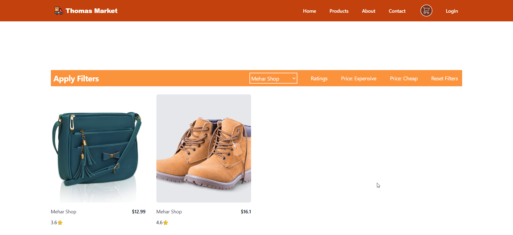

## Getting Started

To run this project locally, follow these steps:

1. Clone this repository to your local machine.
2. Navigate to the project directory.
3. Install dependencies using `npm install` or `yarn install`.
4. Start the development server using `npm start` or `yarn start`.
5. Open your browser and visit `http://localhost:3000` to view the website.

